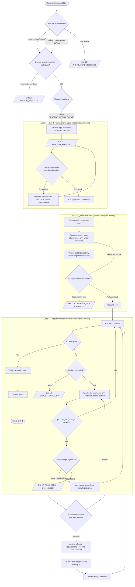

# TDD Skill & Shepherd Plugin — Requirements

## 1. Purpose

A Claude Code skill that drives strict test-driven development for a single feature through three sequential loops: specification (EARS requirements), test generation, and implementation. The skill invokes a Python script built on the **Claude Agent SDK**. The script is a headless, resumable, phase-based state machine; all human interaction is delegated to the outer Claude Code session (which will later be wrapped in a command). Tests are authored and approved before any implementation code exists, and mechanical guardrails — not prompt instructions — prevent the agent from crossing the spec/test/implementation boundaries.

## 2. Scope and non-goals

The skill owns one feature's lifecycle from task statement to green tests. It does not manage backlog, multi-feature orchestration, code review, or deployment. It must never modify production code during Loops 1–2, and must never modify test code during Loop 3 except through the controlled escalation channel described in §10.

## 3. Architecture

The skill follows the **checkpoint state machine** pattern. The script (`scripts/tdd.py`) runs headlessly via the Agent SDK and exits with a distinct code whenever human input is required. The outer Claude Code agent interprets the exit code, gathers the human's decision using its native `AskUserQuestion` tool, and re-invokes the script with that decision as input. The script resumes the relevant SDK session rather than starting fresh, which preserves the prompt-cache prefix across iterations.

The TDD skill is not distributed standalone: it ships inside a **shepherd plugin** (§4). All operational guidance for the outer agent — exit-code handling, "do not fight the hooks," no hand-created `tdd(...)` commits — lives in the plugin's own artifacts: triggering, invocation, and boundary rules in `SKILL.md`, with the per-exit-code playbook in `skills/tdd/references/playbook.md` (loaded before any `run`). The command definition (`/shepherd:tdd`) is a thin entry point that invokes the skill, so both invocation paths converge on the same instructions. No content is injected into the target project's `CLAUDE.md`; instructions load only when the workflow is actually triggered and stay versioned with the shepherd.

## 4. Distribution — the shepherd plugin

Shepherd is a separate repository structured as a **Claude Code plugin** (publishable as its own marketplace), bundling skills, commands, and per-project setup tooling. The plugin is not TDD-specific — the TDD skill and its outer-loop command are simply the first capabilities it ships. Capability distribution (skill, command, hooks) uses the native plugin mechanism; only project-workspace bootstrap is custom.

### Shepherd repo layout

```
shepherd/
├── .claude-plugin/
│   ├── plugin.json              # plugin manifest
│   └── marketplace.json         # marketplace catalog (this repo as its own marketplace)
├── skills/
│   └── tdd/
│       ├── SKILL.md             # trigger conditions, invocation, boundaries
│       ├── scripts/
│       │   └── tdd.py           # phased orchestrator (Claude Agent SDK)
│       └── references/
│           ├── playbook.md      # exit-code contract + per-code playbook (§13)
│           ├── requirements_prompt.md
│           ├── testgen_prompt.md
│           └── impl_prompt.md
├── commands/                    # /shepherd:tdd — thin entry point invoking the skill
├── templates/
│   ├── config.yaml              # default per-loop models, budgets
│   └── gitignore.snippet
├── bin/
│   └── setup.sh                 # per-project setup script
└── docs/
    └── tdd-skill-requirements.md
```

Structural rule: only `plugin.json` lives inside `.claude-plugin/`; `skills/`, `commands/`, and other component directories sit at the plugin root.

The TDD enforcement hooks (path-based edit denial in Loops 2–3) are **Agent SDK in-process hooks inside `tdd.py`** — they travel with the script and require no installation into target projects. Plugin-level hooks are reserved for any future outer-session behaviors.

### Per-project setup (`bin/setup.sh`)

Run once from a target project's root; idempotent; delegates rather than duplicates:

1. **Preflight** — git repo root, Python version, `uv`/`pip` available; fail loudly with fixes, never leave a half-installed state.
2. **Capability registration** — enable the shepherd plugin *project-scoped* by merging `enabledPlugins` into the project's `.claude/settings.json` (careful JSON merge with backup — this file may carry the team's existing config and is never overwritten). Because the settings file is committed, teammates who pull the repo get the shepherd without running anything.
3. **Workspace bootstrap** — invoke `tdd.py init` (§6). The setup script is plumbing; init owns the logic.
4. **Manifest** — write `.shepherd/manifest.json` recording the shepherd version (git SHA) and checksums of installed/merged artifacts, so a future `setup.sh update` can distinguish upstream changes from local modifications and refuse to clobber the latter.

Shepherd leaves a deliberately small footprint in target projects: `.shepherd/` plus one settings entry. No edits to the project's own files.

### Versioning of `tdd.py`

Current decision: the plugin carries the script (one repo, simplest). The script's CLI contract (§6 verbs, §13 exit codes) is kept stable so that extracting the engine into a versioned Python package later — with the skill invoking it via `uvx --from git+…` and projects pinning a version in `config.yaml` — is a mechanical change, not a redesign.

### Local development and testing

During development the plugin is loaded directly, without a marketplace: `claude --plugin-dir /path/to/shepherd` from a scratch project, with `/reload-plugins` picking up edits mid-session. A locally loaded plugin with the same name takes precedence over an installed marketplace copy for that session, which is also the mechanism for testing in-development versions against real projects after publication. Before publishing a release, one pass through the local-marketplace route (`/plugin marketplace add /path/to/shepherd` + install) validates marketplace metadata, caching, and namespacing. Note that `--plugin-dir` exercises only the plugin surface; `setup.sh` (settings merge, init, manifest) runs outside the plugin system and is tested directly in the scratch project. Test installs are confined to disposable scratch projects, due in part to a known Claude Code issue where local/user-scope installs can block reinstallation into a different project.

## 5. Workspace layout (`.shepherd`)

All shepherd state lives in a `.shepherd` folder at the repository root. Each feature is a folder under `.shepherd/features/`, and that feature's runtime state lives in a `.tdd` folder inside it.

```
.shepherd/
├── config.yaml                    # shepherd-wide configuration
└── features/
    ├── user-auth/
    │   ├── task.md                # original task statement, verbatim
    │   ├── requirements/
    │   │   └── *.md               # approved EARS requirements (the contract)
    │   └── .tdd/
    │       ├── state.json         # phase, session IDs, branch, history
    │       ├── traceability.json  # requirement → test mapping with revisions
    │       └── reports/           # gap reports, escalation proposals
    └── payment-retry/
        └── ...
```

Feature slugs are kebab-case, derived from the task title, collision-checked against existing folders. The slug doubles as the git branch suffix and the spec namespace.

Version-control policy: the entire `.shepherd/` workspace is **gitignored** and machine-local. Nothing under it — config, task statements, requirements, `state.json`, `traceability.json`, `reports/` — is ever committed; only test and implementation code enters history.

## 6. Initialization and CLI verbs

The script is a single CLI with subcommands rather than a collection of scripts:

```
tdd.py init                  # bootstrap .shepherd (explicit, never silent)
tdd.py new "Add user auth"   # scaffold a feature folder + tdd/<slug> branch
tdd.py run [--feature slug]  # the three-loop state machine
tdd.py status                # phases of all features
```

**`init` is explicit, not automatic.** If `run` finds no `.shepherd` folder, it exits with code 22 (`SHEPHERD_NOT_INITIALIZED`); the outer command then offers initialization via `AskUserQuestion`. Silent auto-creation is rejected because init makes decisions a human must confirm — above all the detected test command and `test.paths`, which feed the Loop 2/3 enforcement hooks; a wrong auto-detected boundary would undermine the entire safety model.

`init` performs the following, idempotently (re-running never overwrites an existing `config.yaml` without `--force`):

1. Verify execution at a git repository root; refuse otherwise.
2. Create `.shepherd/features/`.
3. Run the deterministic convention scan once and prefill `config.yaml` with the detected test command, test paths, and default models — printing the result with an instruction to review, since detection is a best guess.
4. Check preconditions (`claude-agent-sdk` importable, API auth available) so failures surface at init time rather than mid-Loop-1.
5. Append `.gitignore` entries per the version-control policy in §5.

**`new` owns feature creation**: slug generation and collision check, `task.md` written verbatim, the `tdd/<slug>` branch created, and `state.json` seeded with branch and base commit. This is the step that makes branch-convention resolution (§7) possible.

## 7. Active feature resolution

When multiple features exist under `.shepherd/features/`, the script resolves which one is active in strict priority order, with **no inference and no guessing**:

1. **Explicit argument** — `tdd.py --feature <slug>`. Always wins. The wrapping command threads the slug through every invocation once known.
2. **Git branch convention** — if no argument is given, the current branch must match `tdd/<slug>` and a corresponding feature folder must exist. The script creates this branch when a feature starts, so the working context itself carries the feature identity. This also makes parallel features safe: separate worktrees on separate `tdd/*` branches never contend over shared state.
3. **Error** — anything else exits with code 20 (`NO_FEATURE_RESOLVED`), listing existing features and their phases so the outer command can present them to the human.

Additionally, `state.json` records the branch and base commit the feature was created on. On every invocation the script verifies the current branch matches the recorded one; a mismatch exits with code 21 (`BRANCH_MISMATCH`) unless `--force` is passed. There is deliberately no `ACTIVE` pointer file: pointer files go stale across branch switches, worktrees, and crashed runs, and a stale pointer silently corrupts the wrong feature's state.

## 8. Loop 1 — EARS requirements specification

Using the `requirements` model from config, the agent explores the repository **read-only** (tool surface restricted to Read/Glob/Grep, plus Write scoped to the feature's `requirements/` folder), understands the task from `task.md`, and drafts markdown spec files — one `## REQ-<nnn>: <title>` section per behavior, each holding exactly one EARS statement (`WHEN/WHILE/WHERE/IF…THEN/ubiquitous`, optionally with an examples table), with a short reviewer-facing rationale per file. Requirement ids (`<spec-file-stem>:REQ-<nnn>`) are sequential and never renumbered or reused. The script then exits with code 10 (`AWAITING_APPROVAL`).

The outer command presents the requirements to the human via `AskUserQuestion`. If the human requests corrections, the script is re-invoked with the feedback and **resumes the same SDK session**, appending the feedback as a new turn — everything prior (system prompt, task, repo context, earlier drafts) remains a stable cached prefix. This revision cycle repeats until the human approves. On approval the script advances to Loop 2 — there is no spec commit, since the spec lives in the gitignored `.shepherd/` workspace.

## 9. Loop 2 — Test generation

Using the `testgen` model, this loop turns approved EARS requirements into executable tests in the codebase's **existing** framework and conventions; it must never introduce a framework or convention not already present.

**Convention detection** runs first as a cheap deterministic pre-scan in Python (test config files, test directory layout, an exemplar test file), injected into the prompt so agent turns aren't spent rediscovering the obvious.

**Boundary enforcement is mechanical.** A PreToolUse hook (or `canUseTool` callback) denies any Write/Edit whose path falls outside the configured test paths, returning a clear denial reason. The prompt also states the rule, but the hook is the enforcement.

**Coverage verification** uses the cheap `verifier` model: it receives the requirements and the generated tests and must emit a structured JSON **traceability matrix** (requirement → test function(s) → covered/partial/missing) written to `traceability.json`. Generation iterates on the gaps. If gaps remain after the configured maximum iterations, the script writes a gap report to `.tdd/reports/` and exits with code 11 (`COVERAGE_GAP`) — it raises the issue rather than silently degrading.

The suite is **expected not to compile/pass** at this point, since tests reference implementation that doesn't exist yet. An optional syntax-only check on test files distinguishes malformed tests from missing-implementation errors.

On full coverage the script commits the red state: `tdd(<slug>): red — failing tests`. **This commit happens before Loop 3 begins** and is the recovery anchor — a failed Loop 3 is revertible with a single `git reset --hard`. It is also a permanent, auditable artifact proving the tests existed and failed before the implementation did.

## 10. Loop 3 — Implementation

Using the `implement` model, the agent runs the configured test command, reads failures, edits **main code only**, and repeats until green. The hook polarity inverts: direct Edit/Write on test paths (and on the requirements folder) is now denied — the tests are the contract, and "fixing the test to make it pass" must be impossible as a silent action.

### Escalation channel (test changes)

The agent is given one custom tool, `propose_test_change(test_file, related_requirement, reason, proposed_diff)`, funneling all test-modification pressure through a single auditable channel. The `verifier` model triages each proposal with one question — **does the change alter what the test expects?**

- **Minor / mechanical** (import path, fixture name, syntax error; no change to behavioral expectations): the script auto-applies the scoped edit, logs it in `traceability.json` with a revision note, and the loop continues.
- **Significant** (changed assertion values, weakened conditions, added/removed tests), or any triage verdict of "unsure": the script writes the proposal to `.tdd/reports/`, sets phase `ESCALATED`, and exits with code 12. **Only significant changes escalate.**

On human approval of an escalation, control returns to **Loop 1, incrementally**: the Loop 1 session is resumed with the proposal as feedback and only the affected requirements are amended; Loop 2 then re-syncs only the tests mapped to those requirements via the traceability matrix (requirement `revision` fields are bumped); a **new** red commit is created — `tdd(<slug>): red(n) — amended requirements` — so each spec renegotiation is visible in history; then Loop 3 resumes. On rejection, Loop 3 resumes with the rejection as feedback. The cache invalidation caused by amending early-prefix requirements content is accepted; escalations are rare and correctness wins.

### Completion and budgets

Completion requires the test command to exit 0 **and** the traceability matrix to still validate (a deleted test cannot fake a green run), after which the script commits `tdd(<slug>): green — implementation` and exits 0. Budget guards — max turns per loop, max cumulative cost (tracked from SDK usage data), wall-clock limit — abort with code 13 (`BUDGET_EXCEEDED`) and a status report.

## 11. Configuration

```yaml
# .shepherd/config.yaml
models:
  requirements: claude-opus-4-8   # spec quality matters most
  testgen: claude-sonnet-4-6
  verifier: claude-haiku-4-5      # coverage matrix + escalation triage
  implement: claude-sonnet-4-6
test:
  command: "pytest -x -q"
  paths: ["tests/"]               # feeds the allow/deny hooks
budgets:
  max_turns_per_loop: 40
  max_coverage_iterations: 5
  max_cost_usd: 10
```

Per-feature overrides may be recorded in `state.json`. Models must not be switched within a loop's iteration cycle, as doing so forfeits the cache on every turn; each loop owns its own session and cache lineage.

## 12. Prompt caching strategy

The Agent SDK applies `cache_control` automatically; the script's responsibility is prefix stability and session reuse. Within each loop, every iteration **resumes** the same session and appends a turn — never restarts. Content is ordered by stability: fixed system prompt → task statement → approved requirements → convention-scan results, with volatile content (latest test output) last; no timestamps or mutable status may appear in early prompt sections. The cache hierarchy invalidates everything downstream of a changed early block, so amendments to requirements knowingly forfeit downstream cache. Human approval checkpoints frequently exceed the default 5-minute cache TTL, so the optimization target is the tight machine loops — Loop 2's verifier iterations and Loop 3's test-fix cycles — with the 1-hour TTL an option only if approval rounds are fast. Loops run as flat single-agent sessions; subagent fan-out is avoided due to a known SDK issue where subagent requests skip prompt caching.

## 13. Exit-code contract

| Code | Meaning | Outer command's action |
|------|---------|------------------------|
| 0 | `DONE` — all tests green, traceability intact | Report success |
| 10 | `AWAITING_APPROVAL` — requirements drafted/revised | `AskUserQuestion`: approve or give corrections |
| 11 | `COVERAGE_GAP` — requirements uncoverable after max iterations | Surface gap report to human |
| 12 | `ESCALATED` — significant test change proposed | `AskUserQuestion`: approve (→ Loop 1 amend) or reject |
| 13 | `BUDGET_EXCEEDED` — turn/cost/time limit hit | Surface status report |
| 20 | `NO_FEATURE_RESOLVED` — no `--feature` arg, no `tdd/<slug>` branch | Present feature list, re-invoke with `--feature` |
| 21 | `BRANCH_MISMATCH` — current branch ≠ branch recorded in state | Warn human; re-invoke with `--force` only if intended |
| 22 | `SHEPHERD_NOT_INITIALIZED` — no `.shepherd` folder found | `AskUserQuestion`: offer to run `tdd.py init`, then review generated config |

## 14. Phase model

`DRAFTING_REQUIREMENTS → AWAITING_APPROVAL → REQUIREMENTS_APPROVED → GENERATING_TESTS → VERIFYING_COVERAGE → RED_COMMITTED → IMPLEMENTING → (ESCALATED ⇄ AMENDING_REQUIREMENTS) → GREEN → DONE`, plus `FAILED_<reason>` terminals. Every transition appends `{phase, timestamp, session_id}` to a `history` array in `state.json`, serving as both crash-recovery input and audit log. The script must be safely re-runnable from any recorded phase.

## 15. Flow



## 16. Commit choreography

The script refuses to start on a dirty working tree (untracked `.shepherd` files excepted). Automated commits, in order: `tdd(<slug>): red — failing tests` after Loop 2 verification and **before Loop 3**; `tdd(<slug>): red(n) — amended requirements` after each approved escalation re-sync; `tdd(<slug>): green — implementation` on completion. Red and red(n) commits carry only `test.paths` content — `.shepherd/` artifacts are gitignored and never committed.
